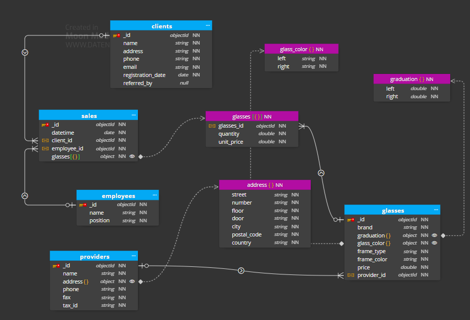
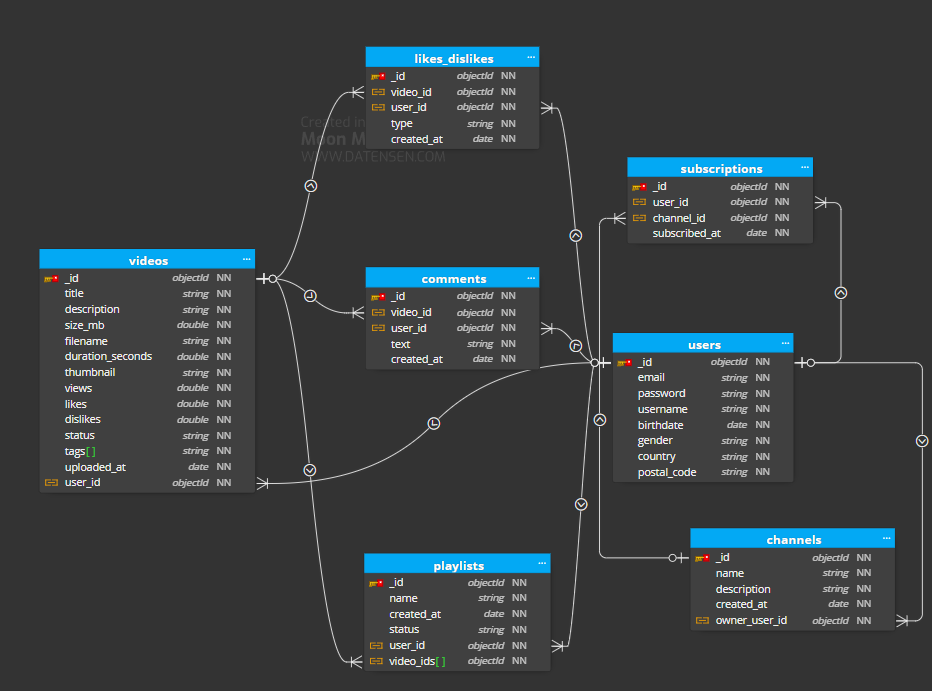

# 2.03-MongoDB-data-structure


## 📄 Description

This repository contains multiple MongoDB databases (optics, food_delivery, youtube) with pre-defined collections and sample data.
Docker Compose is used to set up and run all databases easily, ensuring anyone can start the databases
**without installing MongoDB locally.**

The database initialization is performed using an init.js script, which populates collections in three databases automatically.
Additionally, this repository contains database designs created in Moon Modeler for documentation and visualization purposes.

## Database Diagram

### ex1 - Optics Database

### ex2 - Food Delivery Database

### ex3 - YouTube Database



## 💻 Technologies used

- MongoDB 8.x
- Mongo Express
- Docker 28.x
- Docker Compose 2.x
- IntelliJ IDEA
- Moon Modeler for database design. 

## 📋 Requirements

- Docker installed and running
- Docker Compose installed (comes with Docker Desktop)
- IDE capable of handling projects (e.g., IntelliJ IDEA)
- Optional: Mongo Express to explore the databases in the browser

## 🛠️ Installation

1. Clone the repository:

```bash
git clone https://github.com/ccasro/2.03-MongoDB-data-structure.git
```

2. Open the project in your IDE (e.g., IntelliJ IDEA)
3. Ensure the init-mongo folder contains the init.js file.
4. Create a .env file in the project root (next to docker-compose.yml) with the following template:
```env
MONGO_INITDB_ROOT_USERNAME=admin
MONGO_INITDB_ROOT_PASSWORD=secret
ME_BASICAUTH_USERNAME=user
ME_BASICAUTH_PASSWORD=secret
ME_CONFIG_MONGODB_SERVER=mongodb
MONGO_INITDB_DATABASE=optics

HOST_MONGO_PORT=27017
HOST_MONGOEXPRESS_PORT=8081
```
5. Make sure Docker Desktop is running and the Docker daemon is active.

## ▶️ Execution

1. Open a terminal in the project root folder
2. Run Docker Compose to start MongoDB and Mongo Express:
```bash
docker compose up -d
```
3. Docker will:
    - Create containers for MongoDB and Mongo Express
    - Initializa the databases and collections automatically using init.js
    - Expose MongoDB ports (default 27017) and Mongo Express (default 8081)

4. Access the databases:
    - Mongo Express http://localhost:8081
        - Server: mongodb
        - User: user
        - Password: as defined in your .env file
        - Databases: optics, food_delivery, youtube
5. To stop the containers:
```bash
docker compose down -v
```
## 🌐 Deployment

No production deployment is required. The setup is intended for local development and testing purposes using Docker

## 🤝 Contributions

- Use the main branch for development.
- Make small, frequent commits following Conventional Commits.
- Do not commit sensitive credentials or compiled files
- To propose improvements, create a branch and open a pull request.
